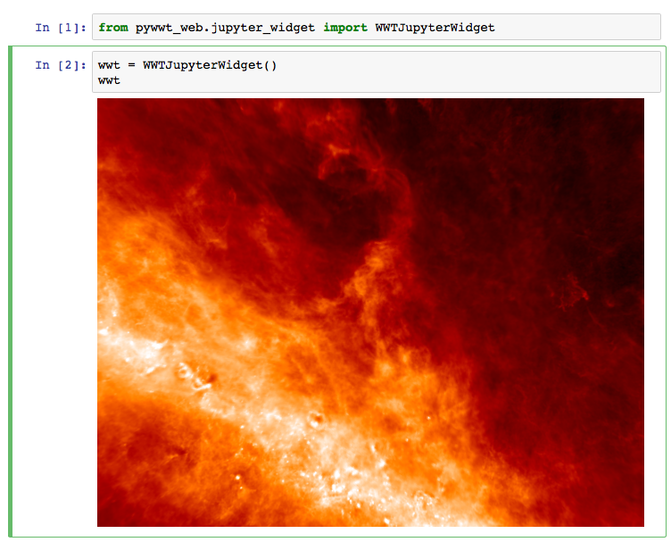

.. image:: https://travis-ci.org/WorldWideTelescope/pywwt.svg?branch=tests
    :target: https://travis-ci.org/WorldWideTelescope/pywwt

.. image:: https://ci.appveyor.com/api/projects/status/hqacnus6g197uo2d/branch/master?svg=true
    :target: https://ci.appveyor.com/project/WorldWideTelescope/pywwt

WorldWideTelescope from Python/Jupyter
======================================

**IMPORTANT NOTE ABOUT THIS PACKAGE:** this package is under heavy development
and is not ready for general use. It will replace, once released, the existing
`pywwt <http://github.com/jzuhone/pywwt>`_ package. The new package will include
both a way to drive the web version of WWT, and the Windows version (using, for
the latter, code from the original pywwt package).

About
-----

The pywwt package aims to make it easy to use WorldWideTelescope from Python,
including from the Jupyter notebook. Only a very small subset of functionality
is implemented for now, and we will be adding functionality over the coming
weeks.

Installation
------------

conda
^^^^^

If you normally use conda and
just want to try out the latest developer version, you can do this with::

    conda install -c conda-forge -c astrofrog/label/dev pywwt

This will install a version built in the last 24 hours so may not strictly be
the absolute latest version.

pip
^^^

If you don't use conda and/or want to use the very latest version, you can clone
this repository and install the package manually (note that this requires
`npm <https://www.npmjs.com>`_ to be installed)::

    git clone https://github.com/WorldWideTelescope/pywwt.git
    cd pywwt
    pip install -e .

If you want to use the Jupyter widget, you will also need to run::

    jupyter nbextension install --py --symlink --sys-prefix pywwt
    jupyter nbextension enable --py --sys-prefix pywwt

(this is not needed if you install the conda package).

Creating a widget
-----------------

Jupyter widget
^^^^^^^^^^^^^^

The Jupyter widget can be used as follows in the Jupyter notebook:

.. code-block:: python

    In [1]: from pywwt.jupyter_widget import WWTJupyterWidget

    In [2]: wwt = WWTJupyterWidget()
       ...: wwt

This will then look like:

Qt widget
^^^^^^^^^

To use the Qt widget, start up an IPython session and do:

.. code-block:: python

    In [1]: from pywwt.qt_widget import WWTQtWidget

    In [2]: %gui qt

    In [3]: wwt = WWTQtWidget()

(note that the order is important - for now ``WWTQtWidget`` has to be imported before ``%gui qt`` is run).

Using the widgets
-----------------

Once a Jupyter or Qt widget has been created, the programmatic user interface is the same. The widget objects should include properties that can be changed, e.g:

.. code-block:: python

    In [4]: wwt.constellation_figures = True

and methods that can be called:

.. code-block:: python

    In [4]: from astropy.coordinates import SkyCoord

    In [5]: from astropy import units as u

    In [6]: coord = SkyCoord.from_name('M42')

    In [7]: widget.center_on_coordinates(coord, fov=10 * u.deg)

We are in the process of writing documentation that includes a full list of
available properties and methods that can be used.

Reporting issues
----------------

If you run into any issues, please open an issue `here
<https://github.com/WorldWideTelescope/pywwt/issues>`_

Acknowledgments
---------------

This work is funded through the American Astronomical Society WorldWideTelescope
project.
