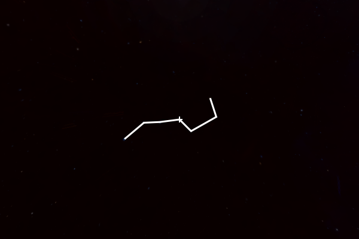

.. _annotations:

Showing annotations
===================

Annotations are shapes that can be manually added to the viewer in order to
highlight specific objects of interest, either for research purposes or when
making a tour/presentation. It's possible to generate several annotations at
once, and you can choose from circles, polygons, and lines.

To add an annotation to the viewer, use either
:meth:`~pywwt.BaseWWTWidget.add_circle`,
:meth:`~pywwt.BaseWWTWidget.add_polygon`, or
:meth:`~pywwt.BaseWWTWidget.add_line` depending on the shape you want to
add. These methods will then return an object that can be used to further set
the visual properties of the annotation. See the sections below for more
information about each specific shape. Note that coordinates must be provided as
:class:`~astropy.coordinates.SkyCoord` objects.

.. note:: If you are interested in plotting a set of positions, data layers
          will be much more efficient/faster than annotations - see :doc:`layers`
          for more details.

Circles
-------

Circles are the simplest kind of annotation and are defined using a center value
and a radius. The radius can be assigned in pixels or degrees/arcseconds as
preferred::

    >>> from astropy import units as u
    >>> from astropy.coordinates import SkyCoord
    >>> crc1 = wwt.add_circle(SkyCoord(188, -57, unit=u.deg),
    ...                       radius=10 * u.degree,
    ...                       fill=True, fill_color='red')

Note that the properties of the circle can either be passed to
:meth:`~pywwt.BaseWWTWidget.add_circle` or can be set/changed on the
returned object afterwards::

    >>> crc1.fill_color = '#008CA8'

See :class:`~pywwt.Circle` for a full list of available properties.

Note that if you don't provide center coordinates, the circle will automatically
be generated in the center of your view::

    >>> wwt.center_on_coordinates(SkyCoord(190, -55, unit=u.deg))
    >>> crc2 = wwt.add_circle(radius=10 * u.pixel, opacity=.4,
    ...                       fill=True, fill_color='#C4D600')

.. image:: images/circles.png
   :align: center

Once an annotation is no longer needed, it can be
removed via its :meth:`~pywwt.Annotation.remove` method. The main
WorldWide Telescope object (``wwt`` in this case) also has a dedicated method
for erasing every existing annotation from view called
:meth:`~pywwt.BaseWWTWidget.clear_annotations`.

To add several identical circles at once, as you might while plotting a survey,
use :meth:`~pywwt.BaseWWTWidget.add_collection()`. This method is built to be
compatible with Astropy workflows, so it can take a column of
:class:`~astropy.coordinates.SkyCoord` style coordinates from an Astropy table
as its argument. (A regular list of coordinates works, too.) Besides its
ability to take several coordinates at once, this method functions exactly like
:meth:`~pywwt.BaseWWTWidget.add_circle`, so optional keyword arguments that set
Circle properties are also available.

Lines
-----

Lines are added, modified, and removed in a similar way to circles, except that
they are defined by a set of positions on the sky rather than a center and a
radius. The following example shows how to create a line of custom width that
traces the Big Dipper, fetching stellar coordinates through a
:class:`~astropy.coordinates.SkyCoord` method and joining them with the
:func:`~astropy.coordinates.concatenate` function from Astropy::

    >>> from astropy import units as u
    >>> from astropy.coordinates import concatenate, SkyCoord
    >>> bd = concatenate((SkyCoord.from_name('Alkaid'),  # stars in Big Dipper
    ...                   SkyCoord.from_name('Mizar'),
    ...                   SkyCoord.from_name('Alioth'),
    ...                   SkyCoord.from_name('Megrez'),
    ...                   SkyCoord.from_name('Phecda'),
    ...                   SkyCoord.from_name('Merak'),
    ...                   SkyCoord.from_name('Dubhe')))
    >>> wwt.center_on_coordinates(SkyCoord.from_name('Megrez'))
    >>> line = wwt.add_line(bd, width=3 * u.pixel)

This code block results in the following picture.

See :class:`~pywwt.Line` for a full list of available properties.

The constellation is not completely connected, but as shown below, points can
also be added after the line has been initialized using
:meth:`~pywwt.Line.add_point`::

    >>> line.add_point(SkyCoord.from_name('Megrez'))

The line color can also be changed using either a color name, color hex string,
or a tuple of (red, green, blue) values (each in the range [0:1]), e.g.::

    >>> line.color = 'salmon'          # html colors
    >>> line.color = 'g'               # matplotlib default colors
    >>> line.color = '#C4D600'         # hex strings
    >>> line.color = (.7, .1, ,.3, .5) # tuples with (or without) opacity

The above example results in the following line annotation:

.. image:: images/big_dipper2.png
   :align: center

Polygons
--------

Polygons are made in the same way as lines, but using the
:meth:`~pywwt.BaseWWTWidget.add_polygon` method::

    >>> polygon = wwt.add_polygon(bd)

Note that vertices should be specified in counter-clockwise order if you intend
to fill the polygon.

See :class:`~pywwt.Polygon` for a full list of available properties.
The main difference compared to lines is that the viewer will automatically
connect the last point added to the first in order to form a closed shape. This
is still the case if new points are added after the shape is initialized.

The closed nature of the shape means a fill color can be toggled on or off, but
*only if the polygon is built counter-clockwise.* Otherwise, no fill will
appear.

Using polygons allows arbitrarily complex shapes to be shown on the sky:

.. image:: images/polygons.png
   :align: center
