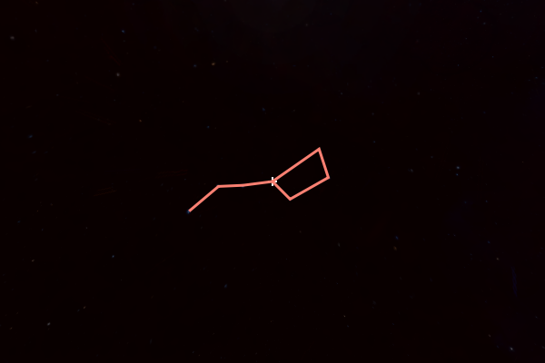
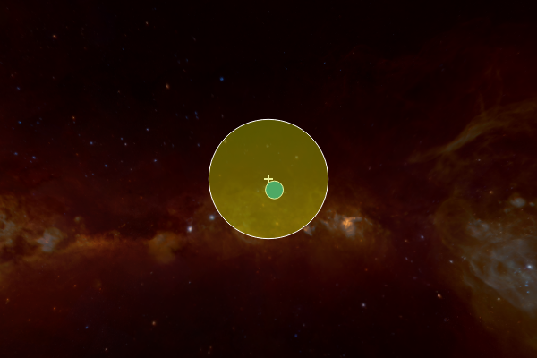

Showing annotations in WorldWide Telescope
==========================================

Annotation objects are shapes that can be manually added to the viewer in 
order to add another dimension of adaptability for use in tours, 
presentations, and the like. It's possible to generate several annotations at 
once, and you can choose from circles, polygons, and lines.

To add an annotation to the viewer, use the method matching your desired shape 
and provide either a center coordinate for circles or the points that make up 
the shape for polygons and lines. (Coordinates must be provided as objects from 
astropy's ``SkyCoord`` class.) Trait assignment can also be handled through 
this method via keyword arguments that match the given shape's available 
traits.

You can put these principles to use in creating a line of custom width that 
traces the Big Dipper, fetching stellar coordinates through a ``SkyCoord`` 
method and joining them with the ``concatenate`` method from 
``astropy.coordinates``:

.. bd = concatenate((SkyCoord.from_name('Alkaid'), SkyCoord.from_name('Mizar'), 
.. SkyCoord.from_name('Alioth'), SkyCoord.from_name('Megrez'), 
.. SkyCoord.from_name('Phecda'), SkyCoord.from_name('Merak'), 
.. SkyCoord.from_name('Dubhe')))
.. wwt.add_line(bd, width = 3 * u.pixel)
.. wwt.center_on_coordinates(SkyCoord.from_name('Megrez'))
   
.. code-block:: python

    In [1]: bd = concatenate((SkyCoord.from_name('Alkaid'), 
       ...:                   SkyCoord.from_name('Mizar'), # stars in Big Dipper
       ...:                   SkyCoord.from_name('Alioth'),
       ...:                   SkyCoord.from_name('Megrez'),
       ...:                   # (and so on...)

    In [2]: wwt.center_on_coordinates(SkyCoord.from_name('Megrez'))
       
    In [3]: line = wwt.add_line(bd, width=3 * u.pixel)

This code block results in the following picture.

.. image:: big_dipper.png

The constellation is not completely connected, but, as shown below, this is 
remediable even after initialization through a method of the shape's class. You 
can also change the line's color with any value allowable through the 
``to_hex`` method from ``matplotlib.colors``.

.. code-block:: python

    In [4]: line.add_point(SkyCoord.from_name('Megrez'))
    
    In [5]: line.color = 'salmon'            # html colors
       ...: # line.color = 'g'               # matplotlib default colors
       ...: # line.color = '#C4D600'         # hex strings
       ...: # line.color = (.7, .1, ,.3, .5) # tuples with (or without) opacity
       
Here is your final line:

.. Only circle fills, polygon fills, and lines have opacities; the lines for
.. circles and polygons do not.

Polygons are made in the same way as lines, though the viewer will 
automatically connect the last point added to the first in order to form a 
closed shape. This is still the case if new points are added after the shape is 
initialized. The closed nature of the shape leads to the availability of a fill 
color (which can be toggled on and off) as well as a variety of final outcomes.

[picture of nice-looking polygon]

Circles are similar to polygons in that their fill and line options are 
changeable, but instead of specifying their points, you select radius and 
center values. Radii can be assigned in pixels or degrees/arcseconds as 
preferred. If you don't provide center coordinates, the circle will 
automatically generate in the center of your view. 

.. code-block:: python

    In [6]: wwt.center_on_coordinates(SkyCoord(190, -55, unit=u.deg))

    In [7]: crc1 = wwt.add_circle(SkyCoord(188, -57, unit=u.deg),
       ...:                       radius=10 * u.degree
       ...:                       fill=True, fill_color ='#008CA8')
       
    In [8]: crc2 = wwt.add_circle(radius=10 * u.pixel, opacity=.4
       ...:                       fill=True, fill_color='#C4D600')
       

The full list of editable traits for any annotation is accessible through its 
``trait_names`` method. Once an it's no longer needed, it can be removed via 
its ``remove_annotation`` method. The widget also has a dedicated method for 
erasing every existing annotation from view called ``clear_annotations``.