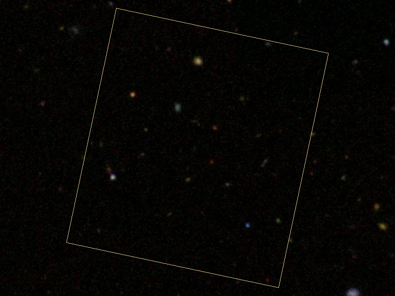

.. _fov:

Showing fields of view
======================

Fields of view (FOVs) are pre-loaded annotations that provide approximate
projections of how instruments from major telescopes look on the sky, which is
useful in simulating observing runs. FOVs for existing instruments (such as
those from NASA's Hubble and Spitzer Space Telescopes), future instruments on
the James Webb Space Telescope, and larger footprints like the field of the K2
mission come out of the box and ready to use with pyWWT.

(If you have an instrument you'd like to simulate, you can still use the methods
from :ref:`annotations` to plot it, but please also consider forwarding its
dimensions and further information to us on GitHub. We are especially interested
in adding more footprints from other sky surveys.)

Plotting an instrument
----------------------

Use the :meth:`~pywwt.BaseWWTWidget.add_fov` method to add a pre-loaded FOV to
the viewer::

    >>> from astropy import units as u
    >>> from astropy.coordinates import SkyCoord
    >>>
    >>> hdf = SkyCoord(189.206, 62.216, unit=u.deg)
    >>> wwt.background = wwt.imagery.visible.sdss
    >>> wwt.center_on_coordinates(hdf, fov=2.8*u.arcmin)
    >>>
    >>> # recreate the Hubble Deep Field image
    >>> fov = wwt.add_fov(wwt.instruments.hst_wfc3_ir, center=hdf,
    ...                   rotate=12*u.deg, line_color='#D4BD8A')

Only certain instrument names are accepted, so be sure to use the
:attr:`~pywwt.BaseWWTWidget.instruments` attribute as shown above to help you
select a valid one. To see which instruments are currently available, either use
tab-completion in an interactive interpreter with
:attr:`~pywwt.BaseWWTWidget.instruments`, or return a list like so::

    >>> wwt.instruments.available
    ['hst_acs_wfc',
    'hst_wfc3_ir',
    'hst_wfc3_uvis',
    'jwst_nircam',
    'jwst_niriss',
    'k2',
    'spitzer_irac']

For :meth:`~pywwt.BaseWWTWidget.add_fov`, the instrument name is the only
required argument; center defaults to the center of your view and rotation
defaults to 0. Additionally, since FOVs are drawn as polygons, editable
properties for annotations (see :class:`~pywwt.Polygon` for a full list) work as
keyword arguments in :meth:`~pywwt.BaseWWTWidget.add_fov`, just as
``line_color`` did in the example at the top of this page.

Once an FOV is no longer needed, it can be removed from view via its
:meth:`~pywwt.FieldOfView.remove` method, e.g.::

    >>> fov.remove()

Note that :meth:`~pywwt.BaseWWTWidget.clear_annotations` will also clear FOVs in
addition to regular annotations.

.. note:: Due to the spherical projection system used by WWT, FOVs may be
          distorted near the poles. This especially true for FOVs that are
          larger in size, contain multiple panels, or have been rotated.
