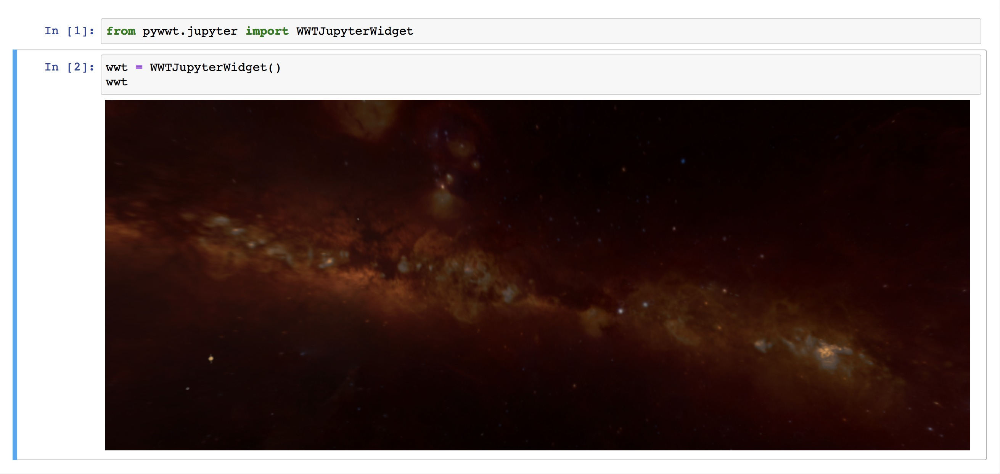

WWT's Jupyter widget
====================

While we recommend `combining WWT with JupyterLab using the "research app"
<jupyterlab>`_, pywwt also provides a traditional `Jupyter widget
<https://ipywidgets.readthedocs.io/>`__ that can be embedded directly in your
Python notebooks.

You can create the WWT widget with the following code::

    In [1]: from pywwt.jupyter import WWTJupyterWidget

    In [2]: wwt = WWTJupyterWidget()
       ...: wwt

This will then look like:

Once the AAS WorldWide Telescope widget is visible, you can start to interact
with the ``wwt`` object in the next cell of the notebook. You can find out more
about interacting with this object in :doc:`settings` and :doc:`annotations`.
See also the API documentation of the :class:`~pywwt.jupyter.WWTJupyterWidget`
class.

.. note:: If the widget appears with a vertical scrollbar, you can remove it
          and show the whole viewer at once by clicking on the left side of the
          cell that holds the widget.
