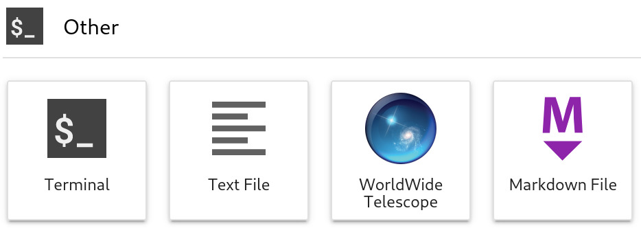

WWT's JupyterLab application
============================

To use WWT in an interactive Python environment, we *strongly* recommend
combining it with `JupyterLab <https://jupyterlab.readthedocs.io/>`_ using WWT's
"research app". It’s worth noting that the JupyterLab web application is a
separate thing than just “Jupyter,” the lower-level system upon which it is
built. `Learn how to set up pywwt's JupyerLab integration JupyterLab here
<installation>`_.

Once the ingration is set up, then the next time you start up JupyterLab the
“Launcher” display should now contain an AAS WorldWide Telescope icon:

Clicking on this icon should open up the `WWT research app
<https://docs.worldwidetelescope.org/research-app/latest/>`_, which you can then
control using pywwt after connecting to it with
:func:`pywwt.jupyter.connect_to_app`.

The optimal WWT+JupyterLab experience requires the installation of several
supporting components: the `WWT Kernel Data Relay`_ (KDR) extension, the `WWT
JupyterLab extension`_, and the `JupyterLab widget manager extension`_. See
:ref:`setup-jupyterlab` for guidance on the complete installation process.

.. _WWT Kernel Data Relay: https://github.com/WorldWideTelescope/wwt_kernel_data_relay/#readme
.. _WWT JupyterLab extension: https://github.com/WorldWideTelescope/wwt-jupyterlab#readme
.. _JupyterLab widget manager extension: https://www.npmjs.com/package/@jupyter-widgets/jupyterlab-manager
