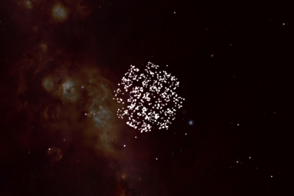
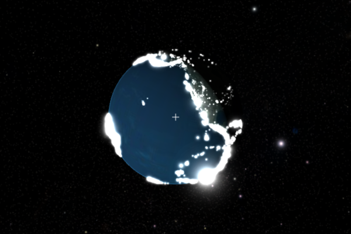

.. _layers:

Adding data layers
==================

While annotations (see :ref:`annotations`) can be used to show specific points
of interest on the sky, data layers are a more general and efficient way of
showing point-based data anywhere in 3D space, including but not limited to
positions on the sky and on/around celestial bodies. In addition, layers can be
used to show image-based data on the celestial sphere.

The main layer type for point-data at the moment is
:class:`~pywwt.layers.TableLayer`. This layer type can be created using an
`astropy <https://docs.astropy.org/en/stable/table/index.html>`__
:class:`~astropy.table.Table` as well as a coordinate frame, which can be e.g.
``'Sky'`` or the name of one of the planets or satellites. The main layer type
for images is :class:`~pywwt.layers.ImageLayer`.

.. TODO: give a more exhaustive list of what can be used as a frame

Loading point data
------------------

To start off, let's look at how to show a simple set positions on the sky. We'll
use the `Open Exoplanet Catalogue <http://openexoplanetcatalogue.com>`_ as a
first example. We start off by using `astropy.table
<https://docs.astropy.org/en/stable/table/index.html>`_ to read in a
comma-separated values (CSV) file of the data::

    >>> from astropy.table import Table
    >>> OEC = 'https://worldwidetelescope.github.io/pywwt/data/open_exoplanet_catalogue.csv'
    >>> table = Table.read(OEC, delimiter=',', format='ascii.basic')

Assuming that you already have either the Qt or Jupyter version of pywwt open
as the ``wwt`` variable, you can then do::

    >>> wwt.layers.add_table_layer(table=table, frame='Sky',
    ...                            lon_att='ra', lat_att='dec')

Note that we have specified which columns to use for the right ascension and
declination (in the ``Sky`` frame, ``lon`` refers to right ascension, and
``lat`` to declination).

Let's now look at how to load data in the frame of reference of a celestial
body. Let's first change the camera settings so that we are looking at the
Earth (see :ref:`views` for more details)::

    >>> wwt.set_view('solar system')
    >>> wwt.solar_system.track_object('Earth')

Be sure to zoom in so that you can see the Earth properly. Next, we use a
dataset that includes all recorded earthquakes in 2010::

    >>> from astropy.table import Table
    >>> EARTHQUAKES = 'https://worldwidetelescope.github.io/pywwt/data/earthquakes_2010.csv'
    >>> table = Table.read(EARTHQUAKES, delimiter=',', format='ascii.basic')

We can then add the data layer using::

    >>> layer = wwt.layers.add_table_layer(table=table, frame='Earth',
    ...                                    lon_att='longitude', lat_att='latitude')

Note that ``lon_att`` and ``lat_att`` don't need to be specified in
:class:`~pywwt.layers.LayerManager.add_table_layer` - they can also be set
afterwards using e.g.::

    >>> layer.lon_att = 'longitude'

In some cases, datasets provide a third dimension that can be used as an
altitude or a radius. This can be provided using the ``alt_att`` column::

    >>> layer.alt_att = 'depth'

Using cartesian coordinates
---------------------------

In some cases, you may instead want to load data in cartesian coordinates. In
this case, you will need to set ``coord_type='rectangular'`` and use ``x_att``,
``y_att``, and ``z_att`` to set the columns to use for the x/y/z positions::

    >>> layer.coord_type = 'rectangular'
    >>> layer.x_att = 'x_kpc'
    >>> layer.y_att = 'y_kpc'
    >>> layer.z_att = 'z_kpc'

and the unit for the coordinates can be set with::

    >>> layer.xyz_unit = 'au'

Editing data settings
---------------------

There are several settings that can be used to fine-tune the interpretation of
the data. First, we can set how to interpret the 'altitude'::

    >>> layer.alt_type = 'distance'

The valid options are ``'distance'`` (distance from the origin), ``altitude``
(outward distance from the planetary surface), ``depth`` (inward distance from
the planetary surface), and ``sealevel`` (reset altitude to be at sea level).

.. TODO: figure out what 'terrain' does.

It is also possible to specify the units to use for the altitude::

    >>> from astropy import units as u
    >>> layer.alt_unit = u.km

This should be an astropy :class:`~astropy.units.Unit` and should be one of
``u.m``, ``u.km``, ``u.au``, ``u.lyr``, ``u.pc``, ``u.Mpc``,
``u.imperial.foot``, or ``u.imperial.mile``. It is also possible to pass a
string provided that when passed to :class:`~astropy.units.Unit` this returns
one of the valid units.

Finally, it is possible to set the units for the longitude::

    >>> layer.lon_unit = u.hourangle

The valid values are ``u.degree`` and ``u.hourangle`` (or simply ``u.hour``) or
their string equivalents.

Enabling time series attributes
-------------------------------

If your table has a column of times, you can animate your data by activating 
the time series attribute and specifying the proper column::

    >>> layer.time_series = True
    >>> layer.time_att = 'time'

(Please note that time columns must contain 
`astropy <https://docs.astropy.org/en/stable/time/index.html>`__
:class:`~astropy.time.Time` objects, :class:`~datetime.datetime` objects,  or 
`ISOT  
<https://docs.astropy.org/en/stable/api/astropy.time.TimeISOT.html#astropy.time.
TimeISOT>`_ compliant strings.)

Once the time in the viewer matches an object's stated time in the table, its
corresponding point will pop into view. See :ref:`views` for more information
on how to control time in the viewer.

By default, time series points disappear 16 days (viewer time, not necessarily
real time) after they pop up. You can adjust their decay time using :class:`~astropy.units.Quantity` objects::

    >>> layer.time_decay = 2 * u.hour
    
To allow time series-enabled points to remain visible forever after they first
appear, set :attr:`~pywwt.layers.TableLayer.time_decay` equal to zero (still
remembering to use units).

.. note:: Limitations of WWT's current date calculation algorithm for time 
          series layers cause decreasing precision in displaying points as
          their dates move away from 2010. For a year like 2019, points within 
          a few seconds of each other appear simultaneously. The same is true 
          for points within a minute of each other for a year like 2110. Points 
          with offsets on the order of days or more are largely unaffected.

Choosing visual attributes
--------------------------

There are a number of settings to control the visual appearance of a layer.
First off, the points can be made larger or smaller by changing::

    >>> layer.size_scale = 10.

It is also possible to make the size of the points depend on one of the columns
in the table. This can be done by making use of the ``size_att`` attribute::

    >>> layer.size_att = 'mag'

then using ``layer.size_vmin`` and ``layer.size_vmax`` to control the values
that should be used for the smallest to largest point size respectively.

Similarly, the color of the points can either be set as a uniform color::

    >>> layer.color = 'red'

or it can be set to be dependent on one of the columns with::

    >>> layer.cmap_att = 'depth'

then using ``layer.cmap_vmin`` and ``layer.cmap_vmax`` to control the values
that should be used for the colors on each end of the colormap. By default
the colormap is set to the Matplotlib 'viridis' colormap but this can be changed
using the following attribute, which should be given the name of a `Matplotlib
colormap <https://matplotlib.org/examples/color/colormaps_reference.html>`_
or a colormap object::

    >>> layer.cmap = 'plasma'

By default, the marker size stays constant relative to the screen, but this can
be changed with::

    >>> layer.marker_scale = 'world'

To change it back to be relative to the screen, you can do::

    >>> layer.marker_scale = 'screen'

Finally, if you want to show all markers even if they are on the far side of
a celestial object, you can use::

    >>> layer.far_side_visible = True

Image layers
------------

Image layers are added in a similar way to point data, using
:class:`~pywwt.layers.LayerManager.add_image_layer`::

    >>> layer = wwt.layers.add_image_layer(image='my_image.fits')

Here, the ``image`` input can be either a filename, an
:class:`~astropy.io.fits.ImageHDU` object, or a tuple of the form
``(array, wcs)`` where ``array`` is a 2-d Numpy array, and ``wcs`` is an
astropy :class:`~astropy.wcs.WCS` object. Once the image has loaded,
you can modify the limits, stretch, and opacity using::

    >>> layer.vmin = -10
    >>> layer.vmax = 20
    >>> layer.stretch = 'log'
    >>> layer.opacity = 0.5

Listing and removing layers
---------------------------

You can list the layers present in the visualization by doing::

    >>> wwt.layers
    Layer manager with 1 layers:

      [0]: TableLayer with 1616 markers

You can remove a layer by either doing::

    >>> layer.remove()

or::

    >>> wwt.layers.remove_layer(layer)

If you don't have a reference to the layer, you can always do::

    >>> wwt.layers.remove_layer(wwt.layers[0])
