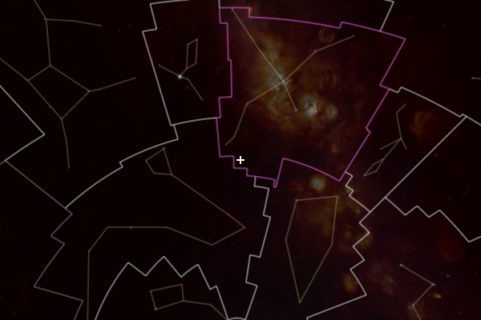
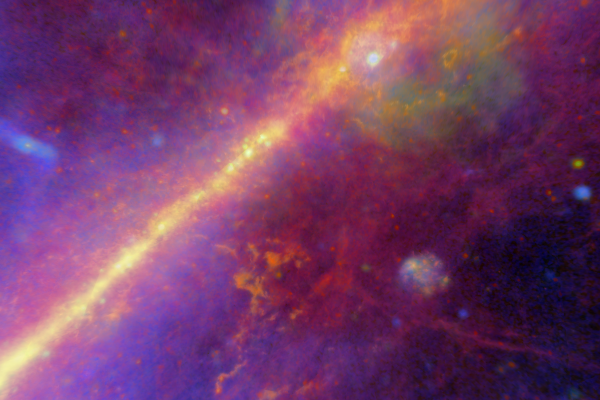

Modifying visual settings
=========================

Once a Jupyter or Qt widget has been created, the way in which you change 
settings and interact with WorldWide Telescope is the same.

Visual settings
---------------

Once the WorldWide Telescope Jupyter or Qt widget has been initialized -- here
we assign it to the variable name ``wwt`` -- you can toggle several visual
settings on and off. For example::

    >>> wwt.constellation_boundaries = True

shows the boundaries of the formally defined regions for each constellation.
You can show the constellations themselves by changing another setting::

    >>> wwt.constellation_figures = True

These two settings and ``constellation_selection`` also have complementary
settings that change their colors. These settings take either color names,
string hex codes, tuples of (red, green, blue) values (where each value
should be in the range [0:1]) tuples or more generally anything recognized
by the :func:`matplotlib.colors.to_hex` function from Matplotlib::

    >>> wwt.constellation_boundary_color = 'azure'
    >>> wwt.constellation_figure_color = '#D3BC8D'
    >>> wwt.constellation_selection_color = (1, 0, 1)

Numerical settings all take values as Astropy :class:`astropy.units.Quantity`
objects, which are floating point values with associated units. To demonstrate
this, let's say you'd like to simulate the celestial view from the top of the
tallest building in Santiago, Chile. You would then enter::

    >>> from astropy import units as u
    >>> wwt.local_horizon_mode = True
    >>> wwt.location_latitude = -33.4172 * u.deg
    >>> wwt.location_longitude = -70.604 * u.deg
    >>> wwt.location_altitude = 300 * u.meter

All of the preceding code results in the following view:

Screenshots like the one above are saved through a widget method that takes
your desired file name its argument::

    >>> wwt.render('stgo_view.png')

Centering on coordinates
------------------------

While you can click and drag to pan around and use scrolling to zoom in and out,
it's also possible to programmatically center the view on a particular object or
region of the sky, given a certain set of coordinates in the form of an astropy
:class:`~astropy.coordinates.SkyCoord` object and a field of view (zoom level in
astropy pixel units) for the viewer. You can read more about creating
:class:`~astropy.coordinates.SkyCoord` objects `here
<http://docs.astropy.org/en/stable/coordinates/index.html>`_. One of the useful
features of this class is the ability to create coordinates based on an object
name, so we can use this here to center on a particular object::

    >>> from astropy import units as u
    >>> from astropy.coordinates import SkyCoord
    >>> coord = SkyCoord.from_name('Alpha Centauri')
    >>> wwt.center_on_coordinates(coord, fov=10 * u.deg)

Foreground/background layers
-----------------------------

Up to two image layers can be shown in the viewer. The viewer's ability to
display multiple layers allows users to visually compare large all-sky surveys
and smaller studies. As the example below shows, they also add a good amount of
aesthetic value for tours or general use. The foreground and background layers
can be set using the ``foreground`` and ``background`` attributes::

    >>> wwt.background = 'Fermi LAT 8-year (gamma)'
    >>> wwt.foreground = 'Planck Dust & Gas'
    >>> wwt.foreground_opacity = .75

The code above superimposes a dust and gas map on an all-sky gamma ray
intensity survey and produces the following output:

You can currently choose from about 20 layers of different wavelengths, scopes,
and eras; you can list them using the widget's ``available_layers`` method::

    >>> wwt.available_layers
    ['2MASS: Catalog (Synthetic, Near Infrared)', '2Mass: Imagery (Infrared)',
     'Black Sky Background', 'Digitized Sky Survey (Color)',
     'Fermi LAT 8-year (gamma)', 'GALEX (Ultraviolet)', 'GALEX 4 Far-UV',
     'GALEX 4 Near-UV', 'Hydrogen Alpha Full Sky Map',
     'IRIS: Improved Reprocessing of IRAS Survey (Infrared)',
     'Planck CMB', 'Planck Dust & Gas', 'RASS: ROSAT All Sky Survey (X-ray)',
     'SDSS: Sloan Digital Sky Survey (Optical)', 'SFD Dust Map (Infrared)',
     'Tycho (Synthetic, Optical)',
     'USNOB: US Naval Observatory B 1.0 (Synthetic, Optical)',
     'VLSS: VLA Low-frequency Sky Survey (Radio)', 'WISE All Sky (Infrared)',
     'WMAP ILC 5-Year Cosmic Microwave Background']

Running tours
-------------

Also present are methods that allow you to load, pause, and resume tours from
the WWT website. To load and play a tour, use the
:meth:`~pywwt.BaseWWTWidget.load_tour` method::

    >>> wwt.load_tour('http://www.worldwidetelescope.org/docs/wtml/tourone.wtt')

You can pause and resume it using the
:meth:`~pywwt.BaseWWTWidget.pause_tour` and
:meth:`~pywwt.BaseWWTWidget.resume_tour` methods.