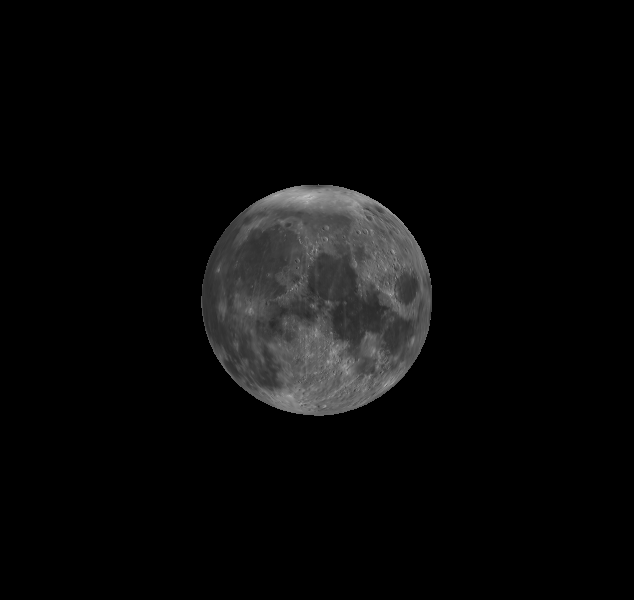
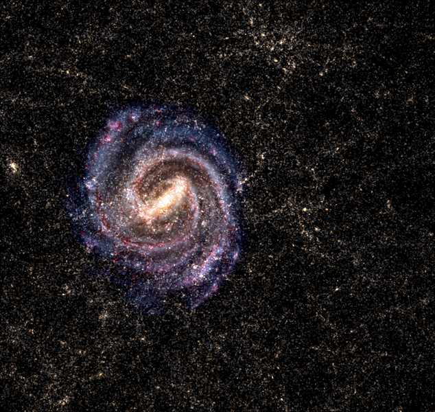
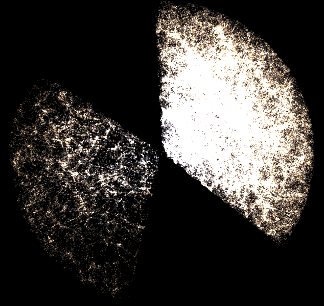

.. _views:

Changing and controlling views
==============================

PyWWT includes the option to toggle between view modes in the same manner as in
the AAS WorldWide Telescope Web Client by using the
:meth:`~pywwt.BaseWWTWidget.set_view` method. Available modes include a view of
the sky, as well as 3D views of celestial bodies, the solar system, the galaxy,
or the observable universe. The rest of the documentation is based on the
default sky mode, so here we discuss what makes the other modes different.

In general, changing view involves using the
:meth:`~pywwt.BaseWWTWidget.set_view` method with a string that indicates the
desired view. You can find a list of available views by doing::

    >>> wwt.available_views
    ['callisto', 'earth', 'europa', 'ganymede', 'io', 'jupiter', 'mars',
    'mercury', 'milky way', 'moon', 'neptune', 'panorama', 'pluto', 'saturn',
    'sky', 'solar system', 'sun', 'universe', 'uranus', 'venus']

Planet view
-----------

Use this mode to get individual views of most of the major objects in the solar
system -- the Sun, the planets, Pluto, Earth's Moon, and Jupiter's Galilean
satellites. To use this mode, enter the name of your desired object as the
argument for :meth:`~pywwt.BaseWWTWidget.set_view`::

    >>> wwt.set_view('Moon')

Once you've done that, your view should resemble the following:

Solar System, Milky Way, and Universe views
-------------------------------------------

These three views come from the same mode at different field-of-view levels.

Solar system
^^^^^^^^^^^^

This mode displays all objects that orbit the Sun. To access it, enter::

    >>> wwt.set_view('Solar System')

All attributes and methods of solar system mode are housed within the widget's
``solar_system`` object so they're easier to find. Like the sky view, it's
possible to edit this view to your liking. For example, orbit paths are shown
by default, but if you would like to turn them off, use the
:attr:`~pywwt.solar_system.SolarSystem.orbits` attribute::

    >>> wwt.solar_system.orbits = False

The objects themselves can also be hidden using a similar technique. Another
useful attribute, ``scale``, enables you to change the size of the major
objects on a scale from 1 (actual size) to 100. We plan to reveal more options
soon to match those currently present in the Web Client.

This mode also comes with its own method,
:meth:`~pywwt.solar_system.SolarSystem.track_object`, that centers the viewer on a major
solar system object of your choice as it both rotates and follows its orbital
path::

    >>> wwt.solar_system.track_object('Jupiter')

.. note::   ``track_object`` is similar in spirit and syntax to planet view,
            but they are not the same. The former exists within the context of
            the whole solar system, so if you choose to track Jupiter as above,
            you'll see its moons in orbit, the Sun in the distance, and the
            stars and Milky Way as the backdrop. Planet view displays the
            object in question and nothing else.

Milky Way
^^^^^^^^^

The Milky Way view changes the scale of the view such that all of the galaxy is
visible:

It can be used as a base point for exploration of galaxies. Access it by
entering::

    >>> wwt.set_view('Milky Way')

Universe
^^^^^^^^

The Universe view zooms all the way out to the extent of the observed universe:

.. note:: If you're ever lost inside a mode, backtrack to its initial state by
          using the :meth:`~pywwt.BaseWWTWidget.reset_view` method.

Panorama view
-------------

This view provides 360-degree panoramas taken during various NASA missions to
Mars and the Moon. It's currently only possible to explore a single image from
NASA's Pathfinder rover on Mars. The rest of the panoramas and their
view-specific functionalities will be imported from the Web Client in a future
release.

Time controls
-------------

By default, WWT shows views changing in real time. To pause the passage of time,
you can use the :meth:`~pywwt.BaseWWTWidget.pause_time` method::

    >>> wwt.pause_time()

You can then resume the passage of time with the
:meth:`~pywwt.BaseWWTWidget.play_time` method::

    >>> wwt.play_time()

You can also change the rate of passage of time by passing a ``rate`` argument
to :meth:`~pywwt.BaseWWTWidget.play_time` - for example, to speed things up by
a factor of 10000, use::

    >>> wwt.play_time(rate=10000)
    
It is also possible to specify a time in the viewer yourself through the 
:meth:`~pywwt.BaseWWTWidget.set_current_time` method as long as the time
provided is a :class:`~datetime.datetime` or an
`astropy <https://docs.astropy.org/en/stable/time/index.html>`_
:class:`~astropy.time.Time` object::

    >>> from astropy.time import Time
    >>> my_time = Time('2017-03-09')
    >>> wwt.set_current_time(my_time)
    
To bring the viewer back to real time, call
:meth:`~pywwt.BaseWWTWidget.set_current_time` without an argument.

If you're unsure of where in time you've landed, the
:meth:`~pywwt.BaseWWTWidget.get_current_time` method returns the viewer's 
current time as an :class:`astropy.time.Time` object in UTC::

    >>> wwt.get_current_time()
    <Time object: scale='utc' format='isot' value=2019-09-21T08:02:37.696>
